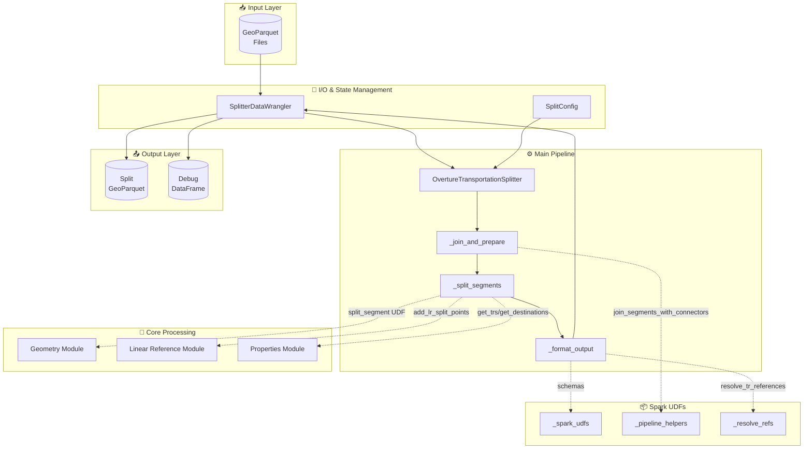
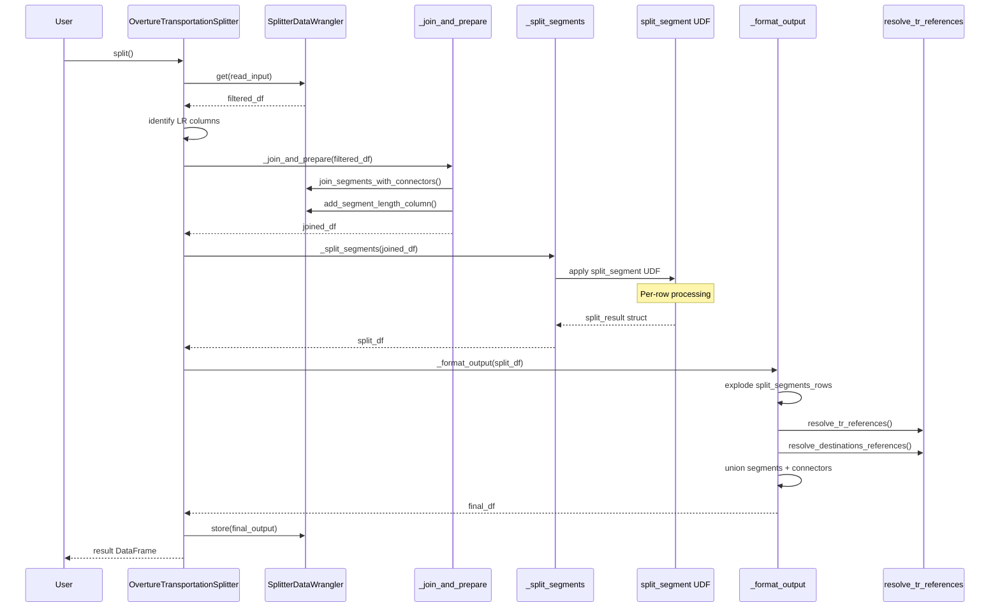
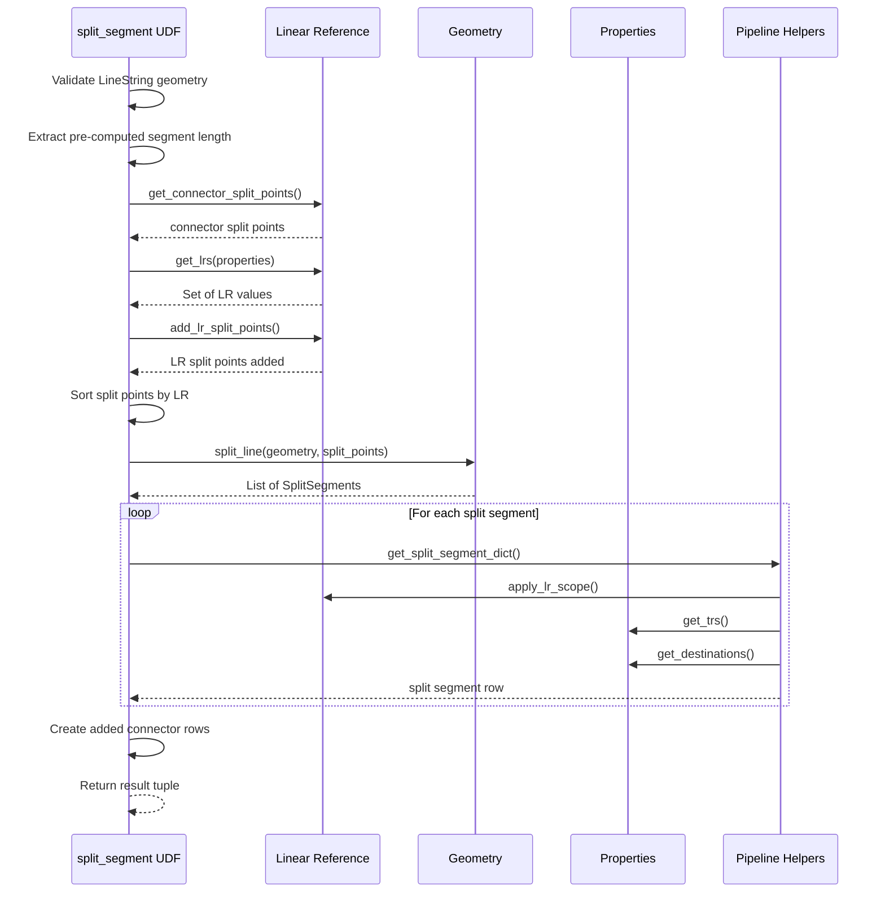
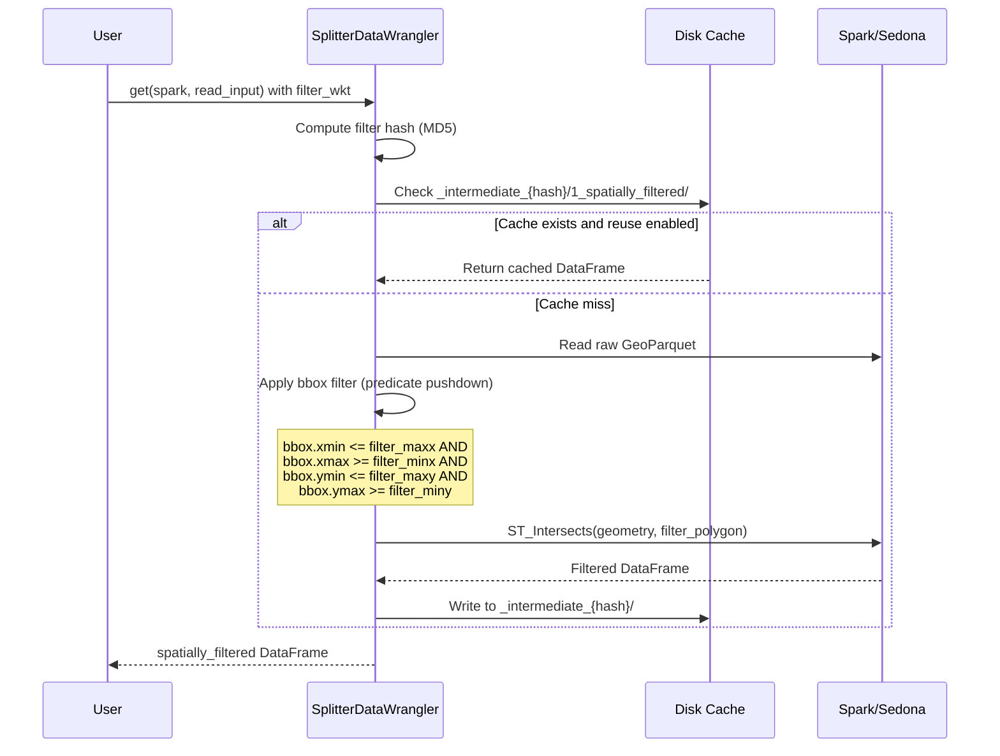
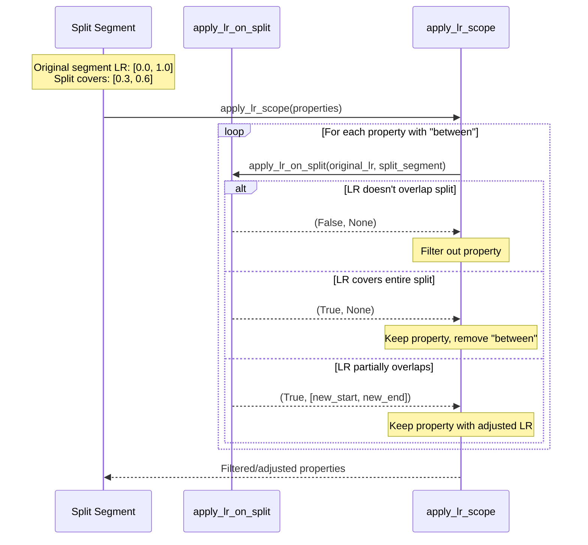
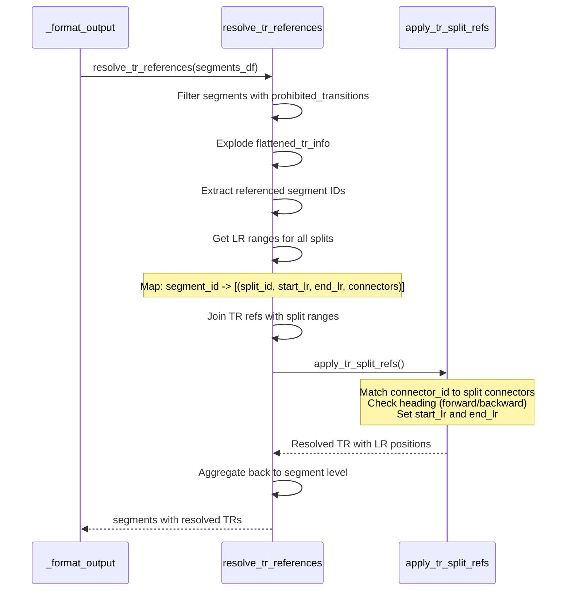

# Transportation Splitter - Onboarding Documentation

> **Comprehensive developer guide for the Overture Maps Transportation Splitter**

---

## 1. Overview

### Purpose

The **Transportation Splitter** is a production-grade PySpark application that processes Overture Maps transportation data. It intelligently splits complex road segments into simpler sub-segments, making the data easier to consume for GIS and transportation applications.

### Problem It Solves

Overture transportation data contains complex multi-connector segments with linear-reference-scoped properties. Raw consumption is difficult because:

- Segments can have many connectors along their length
- Properties (speed limits, road flags) apply to portions using `between` linear references
- Turn restrictions reference specific connector positions

The splitter simplifies this by:

1. Creating sub-segments with **exactly 2 connectors** each (one at each end)
2. Creating "artificial" connectors at LR boundaries
3. Re-scoping all properties to the sub-segment level
4. Fully qualifying turn restriction references

### Key Features

- 🔀 Split segments at connectors and/or linear reference boundaries
- 🌐 Spatial filtering with WKT polygons (bbox predicate pushdown)
- 💾 Intermediate file caching for resumable pipelines
- 🚀 Planet-scale optimizations (shuffle hash joins, Sedona integration)
- 📊 Comprehensive debug output for diagnostics

### Technologies Used

| Component           | Technology    | Version     |
| ------------------- | ------------- | ----------- |
| **Language**        | Python        | 3.10+       |
| **Processing**      | PySpark       | 3.5.x       |
| **Geospatial**      | Apache Sedona | 1.8.x       |
| **Geometry**        | Shapely       | 2.0+        |
| **Format**          | GeoParquet    | Arrow-based |
| **Package Manager** | uv            | Latest      |
| **Testing**         | pytest        | 8+          |
| **Linting**         | ruff          | 0.8+        |

---

## 2. High-Level Architecture Diagram



### Component Summary

| Component                          | File                   | Purpose                                                             |
| ---------------------------------- | ---------------------- | ------------------------------------------------------------------- |
| **OvertureTransportationSplitter** | `pipeline.py`          | Main orchestrator class - coordinates the entire splitting pipeline |
| **SplitterDataWrangler**           | `wrangler.py`          | I/O handling, caching, spatial filtering, geometry conversion       |
| **SplitConfig**                    | `config.py`            | Configuration dataclass with all tunable parameters                 |
| **Geometry Module**                | `geometry.py`          | Pure geometric operations (split_line, get_length)                  |
| **Linear Reference**               | `linear_reference.py`  | LR extraction, application, and split point creation                |
| **Properties**                     | `properties.py`        | Turn restriction and destination filtering                          |
| **Pipeline Helpers**               | `_pipeline_helpers.py` | Join operations, segment length computation                         |
| **Resolve Refs**                   | `_resolve_refs.py`     | Post-split reference resolution for TRs/destinations                |
| **Spark UDFs**                     | `_spark_udfs.py`       | Schema definitions and UDF utilities                                |

---

## 3. Component Breakdown

### Component: OvertureTransportationSplitter

**File**: [pipeline.py](transportation-splitter/transportation_splitter/pipeline.py)

**Purpose**: Main pipeline orchestrator that coordinates the entire segment splitting process.

**Key Elements**:

- [`OvertureTransportationSplitter`](transportation-splitter/transportation_splitter/pipeline.py#L67) - Main class (Lines 67-591)
- [`split()`](transportation-splitter/transportation_splitter/pipeline.py#L137) - Primary entry point method
- [`_join_and_prepare()`](transportation-splitter/transportation_splitter/pipeline.py#L174) - Join segments with connectors
- [`_split_segments()`](transportation-splitter/transportation_splitter/pipeline.py#L201) - Apply split UDF
- [`_apply_split_udf()`](transportation-splitter/transportation_splitter/pipeline.py#L224) - Core UDF implementation
- [`_format_output()`](transportation-splitter/transportation_splitter/pipeline.py#L362) - Flatten and resolve references
- [`_create_debug_output()`](transportation-splitter/transportation_splitter/pipeline.py#L464) - Create diagnostic DataFrame

**Depends On**:

- Internal: `wrangler.py`, `config.py`, `geometry.py`, `linear_reference.py`, `properties.py`, `_pipeline_helpers.py`, `_resolve_refs.py`, `_spark_udfs.py`
- External: PySpark, Apache Sedona, Shapely

---

### Component: SplitterDataWrangler

**File**: [wrangler.py](transportation-splitter/transportation_splitter/wrangler.py)

**Purpose**: Central state manager handling I/O, caching, spatial filtering, and geometry format conversion.

**Key Elements**:

- [`SplitterDataWrangler`](transportation-splitter/transportation_splitter/wrangler.py#L66) - Dataclass (Lines 66-593)
- [`SplitterStep`](transportation-splitter/transportation_splitter/wrangler.py#L28) - Enum for pipeline steps
- [`store()`](transportation-splitter/transportation_splitter/wrangler.py#L172) - Store DataFrame to cache
- [`get()`](transportation-splitter/transportation_splitter/wrangler.py#L210) - Retrieve DataFrame from cache
- [`_apply_spatial_filter()`](transportation-splitter/transportation_splitter/wrangler.py#L301) - Bbox + geometry filtering
- [`InputFormat`](transportation-splitter/transportation_splitter/wrangler.py#L50) / [`OutputFormat`](transportation-splitter/transportation_splitter/wrangler.py#L58) - Format enums

**Depends On**:

- Internal: `geometry.py` (for WKT sanitization)
- External: PySpark, Sedona

---

### Component: SplitConfig

**File**: [config.py](transportation-splitter/transportation_splitter/config.py)

**Purpose**: Configuration dataclass controlling all splitting behavior.

**Key Elements**:

- [`SplitConfig`](transportation-splitter/transportation_splitter/config.py#L18) - Configuration dataclass (Lines 18-59)
- [`DEFAULT_CFG`](transportation-splitter/transportation_splitter/config.py#L61) - Pre-instantiated default config
- [`PROHIBITED_TRANSITIONS_COLUMN`](transportation-splitter/transportation_splitter/config.py#L5) - Turn restrictions column name
- [`DESTINATIONS_COLUMN`](transportation-splitter/transportation_splitter/config.py#L6) - Destinations column name
- [`LR_SCOPE_KEY`](transportation-splitter/transportation_splitter/config.py#L7) - Key for LR scope (`"between"`)

**Configuration Options**:

| Field                            | Type        | Default | Description                 |
| -------------------------------- | ----------- | ------- | --------------------------- |
| `split_at_connectors`            | `bool`      | `False` | Split at every connector    |
| `lr_columns_to_include`          | `list[str]` | `[]`    | Whitelist LR columns        |
| `lr_columns_to_exclude`          | `list[str]` | `[]`    | Blacklist LR columns        |
| `point_precision`                | `int`       | `7`     | Decimal places (~1cm)       |
| `lr_split_point_min_dist_meters` | `float`     | `0.01`  | Min distance between splits |
| `skip_debug_output`              | `bool`      | `True`  | Skip expensive debug ops    |

---

### Component: Domain Models

**File**: [models.py](transportation-splitter/transportation_splitter/models.py)

**Purpose**: Core domain models representing connectors, split points, and split segments.

**Key Elements**:

- [`JoinedConnector`](transportation-splitter/transportation_splitter/models.py#L8) - Connector with geometry (Lines 8-15)
  - `connector_id`, `connector_geometry`, `connector_index`, `connector_at`
- [`SplitPoint`](transportation-splitter/transportation_splitter/models.py#L18) - Single split location (Lines 18-43)
  - `id`, `geometry`, `lr`, `lr_meters`, `is_lr_added`, `at_coord_idx`
- [`SplitSegment`](transportation-splitter/transportation_splitter/models.py#L46) - Result segment (Lines 46-72)
  - `id`, `geometry`, `start_split_point`, `end_split_point`, `length` (computed)

---

### Component: Geometry Module

**File**: [geometry.py](transportation-splitter/transportation_splitter/geometry.py)

**Purpose**: Pure geometric operations for segment manipulation.

**Key Elements**:

- [`split_line()`](transportation-splitter/transportation_splitter/geometry.py#L37) - Main splitting algorithm (Lines 37-58)
- [`get_length()`](transportation-splitter/transportation_splitter/geometry.py#L31) - Geodesic length via WGS84
- [`has_consecutive_dupe_coords()`](transportation-splitter/transportation_splitter/geometry.py#L10) - Validate geometries
- [`remove_consecutive_dupes()`](transportation-splitter/transportation_splitter/geometry.py#L16) - Clean coordinates
- [`round_point()`](transportation-splitter/transportation_splitter/geometry.py#L26) - Precision rounding
- [`get_length_bucket()`](transportation-splitter/transportation_splitter/geometry.py#L68) - Diagnostic bucketing

**Depends On**:

- Internal: `models.py` (SplitPoint, SplitSegment)
- External: Shapely, pyproj

---

### Component: Linear Reference Module

**File**: [linear_reference.py](transportation-splitter/transportation_splitter/linear_reference.py)

**Purpose**: Linear reference extraction, application, and split point creation.

**Key Elements**:

- [`get_lrs()`](transportation-splitter/transportation_splitter/linear_reference.py#L18) - Extract LR values from nested data (Lines 18-27)
- [`apply_lr_on_split()`](transportation-splitter/transportation_splitter/linear_reference.py#L48) - Apply single LR to split (Lines 48-93)
- [`apply_lr_scope()`](transportation-splitter/transportation_splitter/linear_reference.py#L96) - Recursive LR filtering (Lines 96-160)
- [`add_lr_split_points()`](transportation-splitter/transportation_splitter/linear_reference.py#L163) - Create split points at LRs (Lines 163-235)
- [`get_connector_split_points()`](transportation-splitter/transportation_splitter/linear_reference.py#L238) - Extract from connectors (Lines 238-363)

**Depends On**:

- Internal: `models.py`, `config.py`
- External: pyproj, Shapely

---

### Component: Properties Module

**File**: [properties.py](transportation-splitter/transportation_splitter/properties.py)

**Purpose**: Turn restriction and destination filtering for split segments.

**Key Elements**:

- [`get_trs()`](transportation-splitter/transportation_splitter/properties.py#L4) - Filter turn restrictions (Lines 4-64)
- [`get_destinations()`](transportation-splitter/transportation_splitter/properties.py#L67) - Filter destinations (Lines 67-82)
- [`_destination_applies()`](transportation-splitter/transportation_splitter/properties.py#L85) - Destination filter logic (Lines 85-114)

**Depends On**:

- Internal: None (pure logic)
- External: None

---

### Component: Pipeline Helpers

**File**: [\_pipeline_helpers.py](transportation-splitter/transportation_splitter/_pipeline_helpers.py)

**Purpose**: Internal pipeline functions for joins and segment processing.

**Key Elements**:

- [`add_segment_length_column()`](transportation-splitter/transportation_splitter/_pipeline_helpers.py#L32) - Pre-compute length via Sedona (Lines 32-46)
- [`join_segments_with_connectors()`](transportation-splitter/transportation_splitter/_pipeline_helpers.py#L49) - Join with shuffle hash (Lines 49-111)
- [`get_split_segment_dict()`](transportation-splitter/transportation_splitter/_pipeline_helpers.py#L155) - Create output row (Lines 155-213)
- [`get_connectors_for_split()`](transportation-splitter/transportation_splitter/_pipeline_helpers.py#L119) - Map connectors to split (Lines 119-152)
- [`SEGMENT_LENGTH_COLUMN`](transportation-splitter/transportation_splitter/_pipeline_helpers.py#L21) - Constant: `"segment_length_meters"`
- [`LR_PRECISION_DECIMALS`](transportation-splitter/transportation_splitter/_pipeline_helpers.py#L29) - Constant: `9` (sub-mm precision)

---

### Component: Reference Resolution

**File**: [\_resolve_refs.py](transportation-splitter/transportation_splitter/_resolve_refs.py)

**Purpose**: Resolve turn restriction and destination references to split segments.

**Key Elements**:

- [`resolve_tr_references()`](transportation-splitter/transportation_splitter/_resolve_refs.py#L17) - Resolve TR refs (Lines 17-109)
- [`resolve_destinations_references()`](transportation-splitter/transportation_splitter/_resolve_refs.py#L112) - Resolve destination refs (Lines 112-186)
- [`apply_tr_split_refs()`](transportation-splitter/transportation_splitter/_resolve_refs.py#L87) - UDF for TR resolution (Lines 87-101)

---

### Component: Spark UDF Schemas

**File**: [\_spark_udfs.py](transportation-splitter/transportation_splitter/_spark_udfs.py)

**Purpose**: Spark schema definitions and UDF utility functions.

**Key Elements**:

- [`additional_fields_in_split_segments`](transportation-splitter/transportation_splitter/_spark_udfs.py#L14) - Extra output fields (Lines 14-18)
- [`flattened_tr_info_schema`](transportation-splitter/transportation_splitter/_spark_udfs.py#L21) - TR info schema (Lines 21-32)
- [`resolved_prohibited_transitions_schema`](transportation-splitter/transportation_splitter/_spark_udfs.py#L35) - Full TR schema (Lines 35-83)
- [`resolved_destinations_schema`](transportation-splitter/transportation_splitter/_spark_udfs.py#L86) - Destinations schema (Lines 86-113)
- [`contains_field_name()`](transportation-splitter/transportation_splitter/_spark_udfs.py#L116) - Recursive schema search (Lines 116-124)
- [`get_columns_with_struct_field_name()`](transportation-splitter/transportation_splitter/_spark_udfs.py#L127) - Find columns with field (Lines 127-129)
- [`get_filtered_columns()`](transportation-splitter/transportation_splitter/_spark_udfs.py#L132) - Include/exclude filtering (Lines 132-154)

---

## 4. Data Flow & Call Flow Examples

### Flow 1: Basic Segment Splitting Pipeline

**Description**: Complete pipeline from input GeoParquet to split segments with resolved references.



**Key Files**: [pipeline.py](transportation-splitter/transportation_splitter/pipeline.py), [wrangler.py](transportation-splitter/transportation_splitter/wrangler.py), [\_pipeline_helpers.py](transportation-splitter/transportation_splitter/_pipeline_helpers.py), [\_resolve_refs.py](transportation-splitter/transportation_splitter/_resolve_refs.py)

---

### Flow 2: Segment Split UDF Processing

**Description**: Internal processing within the `split_segment` UDF for a single segment.



**Key Files**: [pipeline.py](transportation-splitter/transportation_splitter/pipeline.py#L224), [linear_reference.py](transportation-splitter/transportation_splitter/linear_reference.py), [geometry.py](transportation-splitter/transportation_splitter/geometry.py), [properties.py](transportation-splitter/transportation_splitter/properties.py)

---

### Flow 3: Spatial Filtering with Cache

**Description**: How spatial filtering works with bbox predicate pushdown and caching.



**Key Files**: [wrangler.py](transportation-splitter/transportation_splitter/wrangler.py#L251), [wrangler.py](transportation-splitter/transportation_splitter/wrangler.py#L301)

---

### Flow 4: Linear Reference Application

**Description**: How LR scopes are applied when a segment is split.



**Key Files**: [linear_reference.py](transportation-splitter/transportation_splitter/linear_reference.py#L48), [linear_reference.py](transportation-splitter/transportation_splitter/linear_reference.py#L96)

---

### Flow 5: Turn Restriction Resolution

**Description**: How turn restrictions are resolved after segment splitting.



**Key Files**: [\_resolve_refs.py](transportation-splitter/transportation_splitter/_resolve_refs.py#L17)

---

## 5. Data Models (Entities)

### Entity: [SplitConfig](transportation-splitter/transportation_splitter/config.py#L18)

- **Type**: `@dataclass`
- **Fields**:
  - `split_at_connectors: bool` - Split at every connector (default: `False`)
  - `lr_columns_to_include: list[str]` - Whitelist of LR columns (default: `[]`)
  - `lr_columns_to_exclude: list[str]` - Blacklist of LR columns (default: `[]`)
  - `point_precision: int` - Decimal places for coordinates (default: `7`)
  - `lr_split_point_min_dist_meters: float` - Min split distance (default: `0.01`)
  - `skip_debug_output: bool` - Skip expensive debug ops (default: `True`)
- **Notes**: Use `DEFAULT_CFG` for pre-instantiated defaults

---

### Entity: [JoinedConnector](transportation-splitter/transportation_splitter/models.py#L8)

- **Type**: `@dataclass`
- **Fields**:
  - `connector_id: str` - Unique identifier
  - `connector_geometry: Point` - Shapely Point location
  - `connector_index: int` - Index in reference list
  - `connector_at: float` - Linear reference position (0.0-1.0)
- **Notes**: Represents a connector with its geometry after joining

---

### Entity: [SplitPoint](transportation-splitter/transportation_splitter/models.py#L18)

- **Type**: Class (not dataclass)
- **Fields**:
  - `id: str | None` - Optional identifier
  - `geometry: Point | None` - Shapely Point location
  - `lr: float | None` - Linear reference (0.0-1.0)
  - `lr_meters: float | None` - Distance from segment start
  - `is_lr_added: bool` - True if created from LR (not connector)
  - `at_coord_idx: int | None` - Index in coordinate array
- **Notes**: Represents where a segment should be split

---

### Entity: [SplitSegment](transportation-splitter/transportation_splitter/models.py#L46)

- **Type**: Class (not dataclass)
- **Fields**:
  - `id: str | None` - Segment identifier
  - `geometry: LineString | None` - Shapely LineString
  - `start_split_point: SplitPoint | None` - Start point
  - `end_split_point: SplitPoint | None` - End point
- **Computed Properties**:
  - `length: float` - Calculated from `end_lr_meters - start_lr_meters`
- **Notes**: Result of splitting a segment

---

### Entity: [SplitterStep](transportation-splitter/transportation_splitter/wrangler.py#L28)

- **Type**: `Enum`
- **Values**:
  - `read_input = "input"` - Raw input (read-only)
  - `spatial_filter = "1_spatially_filtered"` - After WKT filter
  - `joined = "2_joined"` - Segments + connectors
  - `raw_split = "3_raw_split"` - Python UDF output
  - `segment_splits_exploded = "4_segments_splits"` - Convenience cache
  - `debug = "_debug"` - Debug output
  - `final_output = "final"` - Final combined output
- **Notes**: Numeric prefixes enable natural sorting in file browsers

---

### Entity: SplitterDataWrangler Attributes

- **Type**: `@dataclass`
- **Required Fields**:
  - `input_path: str` - Input GeoParquet glob pattern
- **Optional Fields**:
  - `output_path: str | None` - Output directory (None = in-memory only)
  - `filter_wkt: str | None` - WKT polygon for spatial filtering
  - `input_format: InputFormat` - Input format detection (default: `AUTO`)
  - `output_format: OutputFormat` - Output format (default: `GEOPARQUET`)
  - `geometry_column: str` - Geometry column name (default: `"geometry"`)
  - `compression: str` - Parquet compression (default: `"zstd"`)
  - `block_size: int` - Row group size (default: `16MB`)
  - `write_intermediate_files: bool` - Cache to disk (default: `True`)
  - `reuse_existing_intermediate_outputs: bool` - Use disk cache (default: `True`)

---

## 6. Testing Structure

### Test Organization

```
tests/
├── conftest.py                 # Shared fixtures (spark_session, test_data_path)
├── data/                       # Test parquet files
│   ├── segment.parquet         # Road segment test data
│   ├── connector.parquet       # Connector point test data
│   ├── boulder_segments.parquet
│   └── boulder_connectors.parquet
├── unit/                       # Pure Python tests (no Spark)
│   ├── test_split.py           # 40+ segment splitting test cases
│   └── test_apply_lr.py        # Linear reference application tests
└── integration/                # Tests requiring Spark/Sedona
    ├── test_e2e.py             # End-to-end pipeline tests
    └── test_boulder_e2e.py     # Boulder, CO real-world tests
```

### Key Fixtures

| Fixture          | Scope    | Purpose                     |
| ---------------- | -------- | --------------------------- |
| `spark_session`  | Session  | Sedona-enabled SparkContext |
| `test_data_path` | Function | Path to test parquet files  |

### Running Tests

```bash
# Unit tests only (fast, no Spark)
uv run pytest tests/unit -v

# All tests (requires Java 11+)
JAVA_HOME=/opt/homebrew/opt/openjdk@11 uv run pytest tests/ -v

# Specific test
uv run pytest tests/unit/test_split.py::TestSplitter::test_split_line_all_cases -v
```

### Writing New Tests

```python
# Unit test example (tests/unit/test_my_feature.py)
import pytest
from transportation_splitter import SplitPoint, SplitSegment, apply_lr_on_split

@pytest.mark.parametrize("case_label, input_lr, expected_result", [
    ("basic_case", [0.0, 0.5], True),
    ("edge_case", [0.5, 1.0], False),
])
def test_my_lr_logic(case_label, input_lr, expected_result):
    split_segment = SplitSegment(...)
    result = apply_lr_on_split(input_lr, split_segment, 1000, 0.01)
    assert result[0] == expected_result

# Integration test example (tests/integration/test_my_e2e.py)
def test_my_pipeline(spark_session):
    from tests.conftest import get_test_data_path

    splitter = OvertureTransportationSplitter(
        spark=spark_session,
        wrangler=SplitterDataWrangler(
            input_path=get_test_data_path(),
            output_path="tests/out/my_test",
        ),
        cfg=SplitConfig(split_at_connectors=True),
    )
    result_df = splitter.split()

    assert result_df.count() > 0
```

---

## 7. Quick Start Guide

### Installation

```bash
# Clone and install
git clone <repository-url>
cd transportation-splitter
uv sync

# Verify Java 11+
java -version  # Must be 11+

# Set JAVA_HOME if needed
export JAVA_HOME=/opt/homebrew/opt/openjdk@11  # macOS
export JAVA_HOME=/usr/lib/jvm/java-11-openjdk  # Linux
```

### Basic Usage

```python
from pyspark.sql import SparkSession
from sedona.spark import SedonaContext
from transportation_splitter import (
    OvertureTransportationSplitter,
    SplitConfig,
    SplitterDataWrangler,
)

# Create Spark session with Sedona
spark = SparkSession.builder.appName("splitter").getOrCreate()
sedona = SedonaContext.create(spark)

# Configure the splitter
splitter = OvertureTransportationSplitter(
    spark=sedona,
    wrangler=SplitterDataWrangler(
        input_path="path/to/overture/*.parquet",
        output_path="output/",
    ),
    cfg=SplitConfig(
        split_at_connectors=True,
        skip_debug_output=False,  # Enable debug output
    ),
)

# Run the pipeline
result_df = splitter.split()

# Access debug information
debug_df = splitter.debug_df
```

### With Spatial Filter

```python
# Filter to a specific region
splitter = OvertureTransportationSplitter(
    spark=sedona,
    wrangler=SplitterDataWrangler(
        input_path="path/to/overture/*.parquet",
        output_path="output/",
        filter_wkt="POLYGON((-105.3 39.9, -105.2 39.9, -105.2 40.0, -105.3 40.0, -105.3 39.9))",
    ),
    cfg=SplitConfig(),
)
result_df = splitter.split()
```

---

## 8. Common Commands

```bash
# Install dependencies
uv sync

# Install with dev/test dependencies
uv sync --group dev --group test

# Run unit tests
uv run pytest tests/unit -v

# Run all tests
JAVA_HOME=/opt/homebrew/opt/openjdk@11 uv run pytest tests/ -v

# Lint and format (ALWAYS run after changes!)
uv run ruff check --fix . && uv run ruff format .

# Run specific test
uv run pytest tests/unit/test_split.py::TestSplitter::test_split_line -v -s
```

---

## 9. Critical Requirements

### Java Version

**Sedona 1.8.x requires Java 11+**. Tests will fail with `NoClassDefFoundError` if using Java 8.

### Scala Version

PySpark from PyPI only ships with **Scala 2.12**. Always use `_2.12` suffix for Sedona JARs.

### Gotchas

| Issue                   | Impact               | Solution                     |
| ----------------------- | -------------------- | ---------------------------- |
| Java 8                  | NoClassDefFoundError | Use Java 11+, set JAVA_HOME  |
| Wrong Scala version     | JAR not found        | Use `_2.12` suffix           |
| Coordinate precision    | Duplicate splits     | Already handled (7 decimals) |
| Self-intersecting lines | LR issues            | Tracked by LR, not geometry  |
| Long WKT strings        | Can't edit           | Don't modify test WKT        |
| Broadcast join failures | OOM at scale         | Uses shuffle_hash hints      |
| Star imports            | Lint failures        | Ruff ignores (PySpark idiom) |

---

## 10. Performance Optimizations

| Optimization                  | Location                         | Benefit                       |
| ----------------------------- | -------------------------------- | ----------------------------- |
| **Bbox Predicate Pushdown**   | `wrangler.py` L327-332           | Parquet row group skipping    |
| **ST_LengthSpheroid**         | `_pipeline_helpers.py` L196      | JVM-based length calculation  |
| **Shuffle Hash Joins**        | `_pipeline_helpers.py` L79, L107 | Prevents broadcast failures   |
| **Broadcast Config**          | `pipeline.py` L226               | Avoids serializing per row    |
| **Intermediate Caching**      | `wrangler.py`                    | Skip recomputation on re-runs |
| **LR Precision (9 decimals)** | `_pipeline_helpers.py` L29       | Sub-millimeter accuracy       |

---

## 11. Public API Reference

```python
from transportation_splitter import (
    # Main entry point
    OvertureTransportationSplitter,

    # Configuration
    SplitConfig,
    DEFAULT_CFG,
    DESTINATIONS_COLUMN,
    PROHIBITED_TRANSITIONS_COLUMN,

    # I/O handling
    SplitterDataWrangler,
    SplitterStep,
    InputFormat,
    OutputFormat,

    # Domain models
    JoinedConnector,
    SplitPoint,
    SplitSegment,

    # Utility functions (for testing/profiling)
    get_length,
    split_line,
    has_consecutive_dupe_coords,
    remove_consecutive_dupes,
    get_lrs,
    apply_lr_on_split,
    add_lr_split_points,
    get_connector_split_points,
)
```

---

## 12. Resources

| Resource           | Link                                              |
| ------------------ | ------------------------------------------------- |
| Overture Maps      | <https://github.com/OvertureMaps>                 |
| Overture Data Docs | <https://github.com/OvertureMaps/data>            |
| PySpark Docs       | <https://spark.apache.org/docs/3.5.0/api/python/> |
| Apache Sedona      | <https://sedona.apache.org/1.8.0/>                |
| Shapely            | <https://shapely.readthedocs.io/>                 |

---
